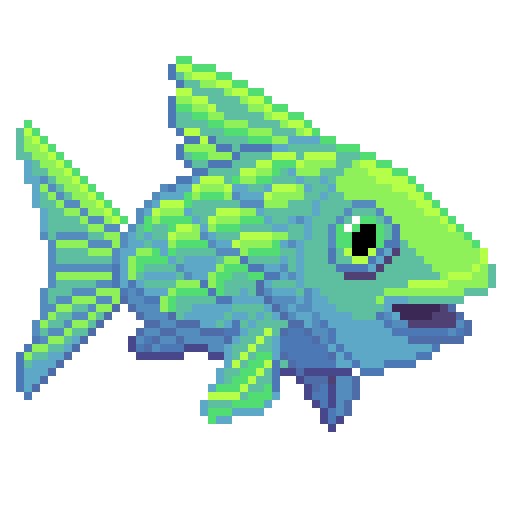

# @SimonBradlow 🍇👨‍🚀
[//]: <> ()

   

   

 
<!---

--->

<!---
- 📫 How to reach me ...
--->
<!---
Shields and Icons: simpleicons.org
--->
<!---
SimonBradlow/SimonBradlow is a ✨ special ✨ repository because its `README.md` (this file) appears on your GitHub profile.
You can click the Preview link to take a look at your changes.
--->
